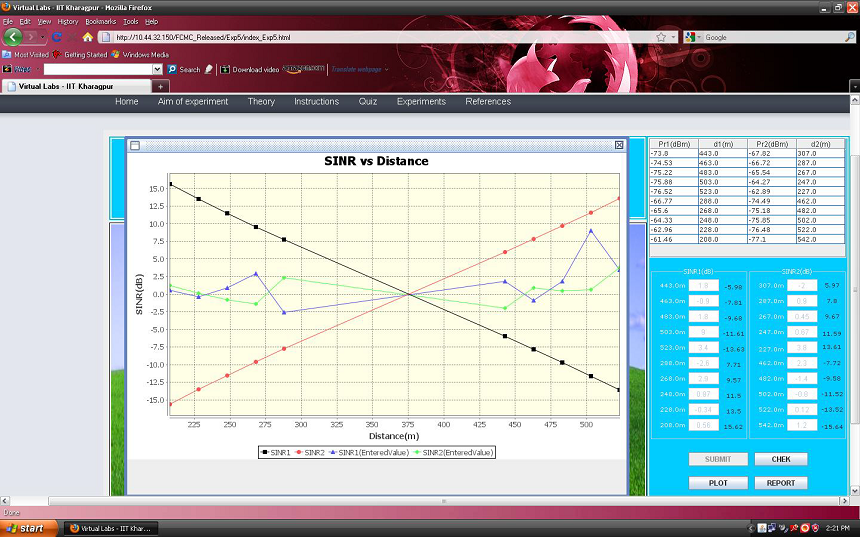
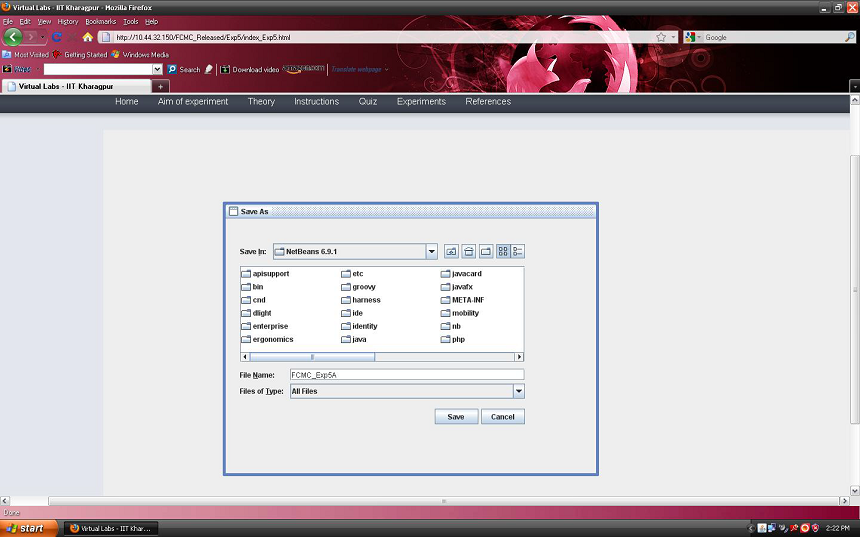
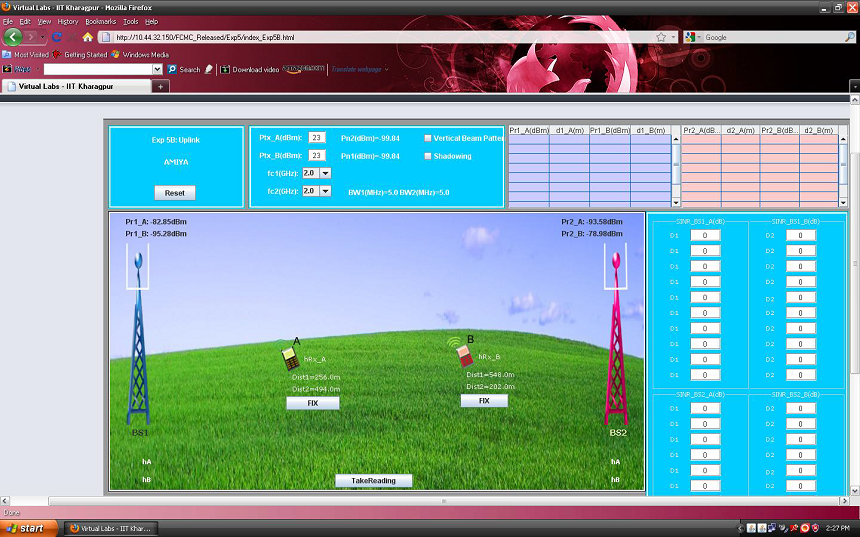
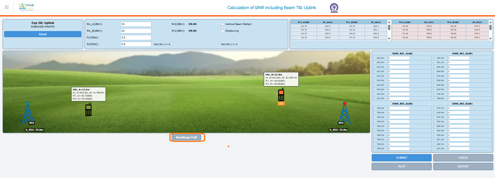

## Procedure

Follow the instructions given below to perform the experiments:-

### 1.1 Starting Experiment 1 :-

- Step 1:-Click on the START button.A page appears with a dialogue box asking for your name.Enter your name and click OK.

- Step 2:-Now the page appears where you can perform experiment1.There are 5 buttons(Exp1A Exp1B Exp1C Exp1D Exp1E) for five experiments to be performed . Choose which experiment you want to perform and click on any one of the button.

### 1.2 Performing Experiment 1A(Calculation of Received Power at a cer-tain Tx-Rx separation distance) :-

- Step 3:- Drag the mobile by placing the cursor on it and place it at a certain distance from the base station tower.

- Step 4:-Click on the button TAKE READING.Your input value get displayed.

- Step 5:-Now,calculate the value of the unknown parameter (for e.g.P_r(d)) manually by using the formulas given in the theory section. For example:- Given P_r(d_0) = -18.44dB, Tx and Rx separation distance(d)= 708 m, d_0 = 55 m. So,using this formula $P_r(d) = P_r(d_0) + 20\log_{10}(d_0/d)$ you can find the value of P_r(d), $P_r(d) = -18.44 + 20\log_{10}(55/708) = -40.37 \text{ dBm}$. Similarly,with the help of the formulas given in the theory section for expt1b,expt1c,expt1d and expt1e you can find the value of the unknown parameter for each of these experiments.

- Step 6:-Now,enter your manually calculated value of the unknown parameter in the box provided in the page.

- Step 7:-Click on the button CHECK to verify whether your manually calculated value matches with the computed value of the unknown parameter.

- Step 8:-If your manually calculated value of the unknown parameter doesn't match with the com-puted value of the unknown parameter then a message box will appear with the message that your calculated value is wrong and it will return the exact value of the unknown parameter.If your cal-culated value of the unknown parameter is same as the computed value of the unknown parameter then the message box will let you know that your result is correct.

- Step 9:-Now, click on the button SUBMIT to submit your results

- Step 10:-You can redo the experiment by clicking on the button REDO.

### 1.3 Performing Experiment 1B(Calculating the path loss exponent) :-

Follow the steps given below to perform Expt 1B

- Step 1:-Follow Step 2 of Expt 1A and select Expt 1B to perform it.

- Step 2:-Follow Step 3-4 of Expt 1A to record the input parameters needed for calculating the value of n_p.You can adjust the slider to change the value of transmit power.

- Step 3:- Now,use this formula to calculate n_p. Input Parameters :- P_t = 50 dBm, P_r(d) = -54.45 dBm, P_r(d_0) = -12.58 dBm, d = 1156 meters, d_0 = 89 meters. $PL(d) = PL(d_0) + 10 n_p \log_{10}(d/d_0) = P_t(d) - P_r(d) = P_t(d_0) - P_r(d_0) + 10 n_p \log_{10}(d/d_0)$, $50 + 54.45 = 50 + 12.58 + 10 n_p \log_{10}(1156/89)$, n_p = 3.76 .

- Step 4:- Follow Steps 6-11 of Expt 1A to submit the results of Expt 1B.

### 1.4 Performing Experiment 1C(Calculating fc) :-

Follow the steps given below to perform Expt1C

- Step 1:-Follow Step 2 of Expt 1A and select Expt 1C to perform it.

- Step 2:-Follow Step 3-4 of Expt 1A to record the input parameters needed for calculating the value of f_c.You can change the values of transmit power,transmit antenna height,receive antenna height by adjusting the sliders.

- Step 3:- Given h_(BS) = 30m, h_(UT) = 1m, d = 1092 m, n_p = 4.65, P_t = 50 dBm, P_r(d) = -83.22 dBm. Now, calculate PL(d) using the formula:- $PL(d) = P_t - P_r(d) = 50 - (-83.22) = 133.22 \text{ dBm}$. Now, use this formula to calculate f_c. $PL(d) = 10 n_p \log_{10}(d) + 7.8 - 18\log_{10}(h_{tx}) - 18\log_{10}(h_{rx}) + 20\log_{10}(f_c)$. Putting the values, $133.22 = 10 \times 4.65 \times \log_{10}(1092) + 7.8 - 18\log_{10}(30) - 18\log_{10}(1) + 20\log_{10}(f_c)$. So, f_c = 3.44 GHz.

Step 4:- Follow Steps 6-11 of Expt 1A to submit the results of Expt 1C.

### 1.5 Performing Experiment 1D(Calculating h_(UT) ):-

Follow the steps given below to perform Expt1D

- Step 1:-Follow Step 2 of Expt 1A and select Expt 1D to perform it.

- Step 2:-Follow Step 3-4 of Expt 1A to record the input parameters needed for calculating the value of h_(UT) .You can change the values of transmit power,frequency,transmit antenna height by adjusting the sliders.

- Step 3:- Given h_(BS) = 30m, f_c = 2GHz, d = 1600m, n_p = 4.02, P_t = 50 dBm, P_r(d) = -51.41 dBm. Now, calculate PL(d) using the formula:- $PL(d) = P_t - P_r(d) = 50 - (-51.41) = 101.41 \text{ dBm}$. Now, use this formula to calculate h_(rx). $PL(d) = 10 n_p \log_{10}(d) + 7.8 - 18\log_{10}(h_{tx}) - 18\log_{10}(h_{rx}) + 20\log_{10}(f_c)$. Putting the values, $101.41 = 10 \times 4.02 \times \log_{10}(1600) + 7.8 - 18\log_{10}(30) - 18\log_{10}(h_{rx}) + 20\log_{10}(2)$. So, h_(rx) = 6.5 meters.
- 

- Step 4:- Follow Steps 6-11 of Expt 1A to submit the results of Expt 1D .

### 1.6 Performing Experiment 1E(Calculating h_(BS)) :-

Follow the steps given below to perform Expt1E

- Step 1:-Follow Step 2 of Expt 1A and select Expt 1E to perform it.

- Step 2:-Follow Step 3-4 of Expt 1A to record the input parameters needed for calculating the value of h_(BS). You can change the values of transmit power,receive antenna height,frequency by adjusting the sliders.

- Step 3:- Given h_(rx) = 1m, f_c = 2GHz, d = 668m, n_p = 3.12, P_t = 50 dBm, P_r(d) = -29.01 dBm. Now, calculate PL(d) using the formula:- $PL(d) = P_t - P_r(d) = 50 - (-29.01) = 79.01 \text{ dBm}$. Now, use this formula to calculate h_(BS). $PL(d) = 10 n_p \log_{10}(d) + 7.8 - 18\log_{10}(h_{tx}) - 18\log_{10}(1) + 20\log_{10}(f_c)$. Putting the values, $79.01 = 10 \times 3.12 \times \log_{10}(668) + 7.8 - 18\log_{10}(h_{tx}) - 18\log_{10}(h_{rx}) + 20\log_{10}(2)$. So, h_(tx) = 16.55 meters.

- Step 4:- Follow Steps 6-11 of Expt 1A to submit the results of Expt 1E.

### 1.7 Generating and saving the Report :-

- Step 11:Click on the GENERATE REPORT button once you finish do ing all the experiments from Expt 1A to Expt 1E.

- Step 12:Click on the button SAVE to save your report.

- Step 13:Finally, a message will appear that your report has been generated successfully.After viewing the message click on the OK button.

- Step 14:You can view the pdf report of the experiment you have done.

    
