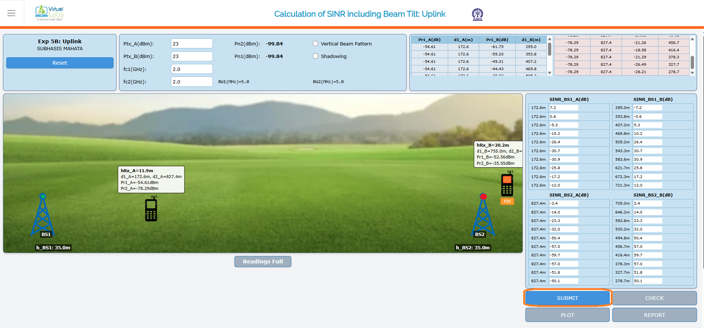
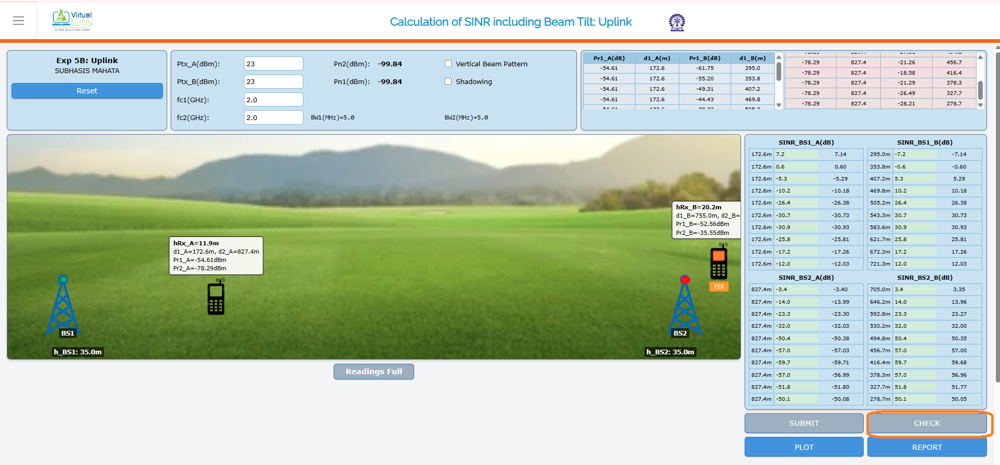
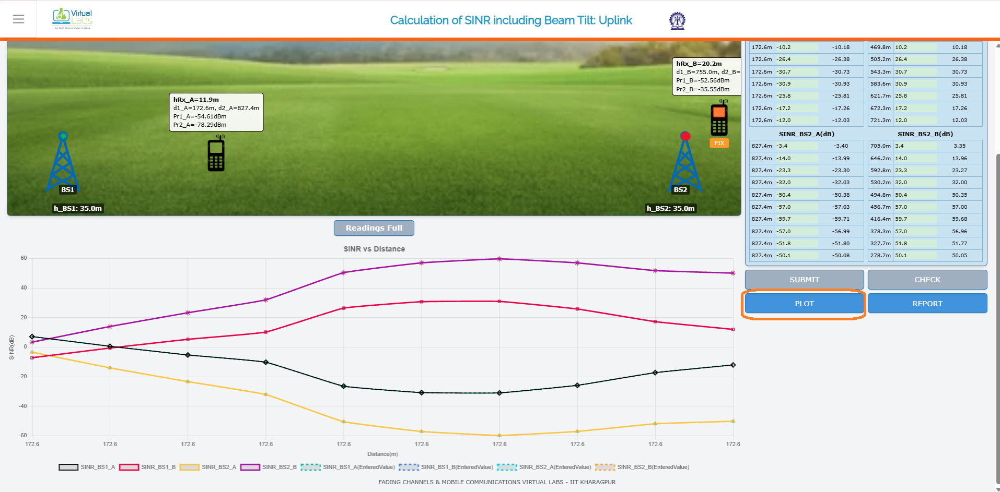
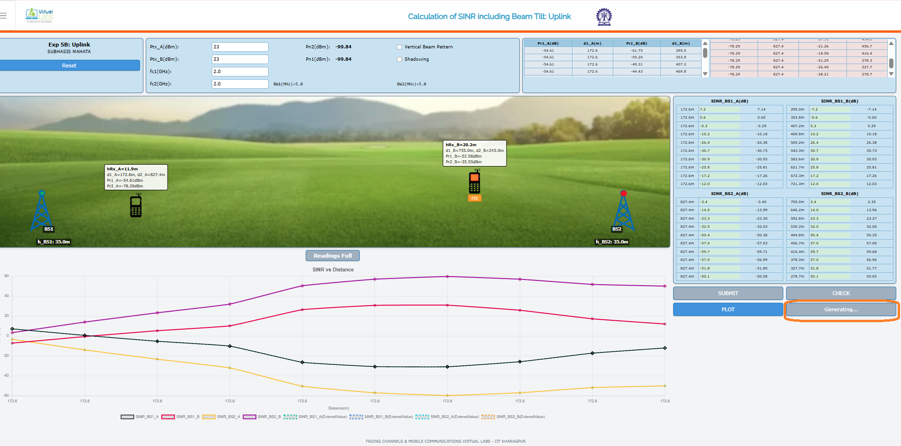
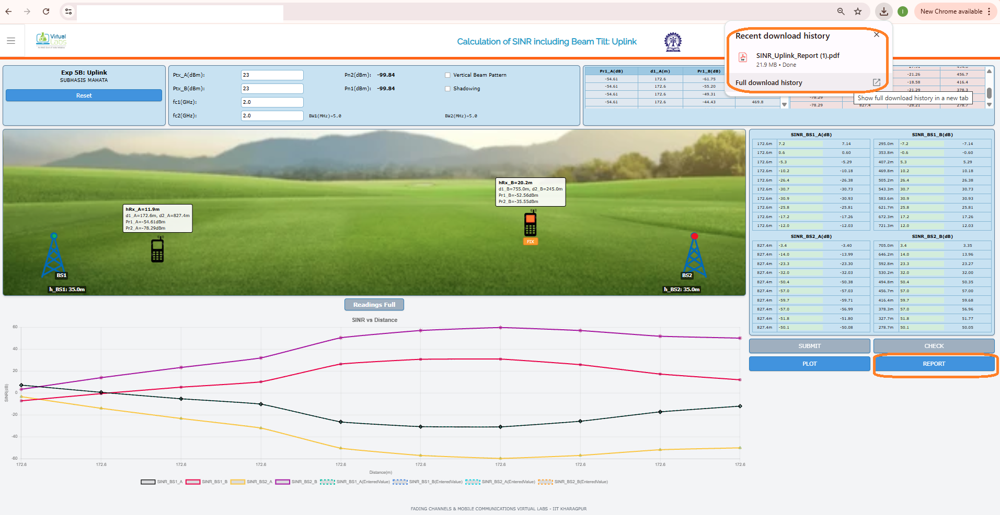
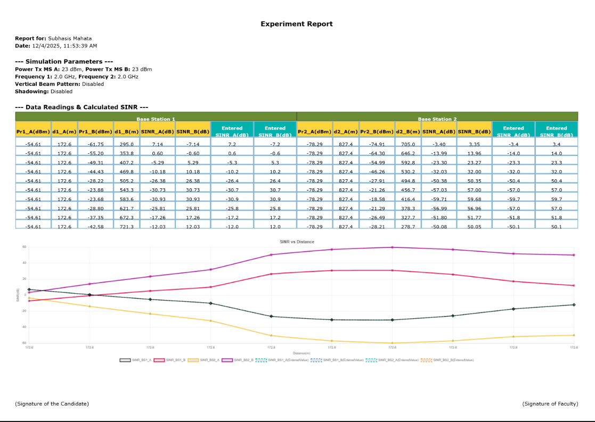

## Procedure

Follow the instructions given below to perform the experiments:-

* Step 1: 'Click here to start' for Experiment 5B (Uplink)

      
      

   
## 1.2 Starting Experiment 5B :-

* Step 2:  A page appears with a dialogue box asking for your name. Enter your name and click OK.

      
      

   
## 1.3 Performing Experiment 5B :-

* Step 3: Drag the mobile A and mobile B to adjust their positions from the base stations. To do the experiment adding the effect of Vertical Beam Pattern with Tilt and Shadowing conditions click on the check boxes `Vertical Beam Pattern` and `Shadowing` selecting required Tilt. The experiment can also be done fixing any one mobile by clicking on the FIX button associated with that mobile.

      
      

   
* Step 4: Click on the button TAKE READING to record the received power by mobile A and mobile B at different distances from the base stations. Take 10 readings.

      
      

    
* Step 5: Calculate the values of `SINR_(1A)`, `SINR_(2A)`, `SINR_(1B)` and `SINR_(2B)` in dB from the formula given in theory section. Enter your manually calculated values in the boxes provided for different SINR parameters in the RHS of the page.

      
      

   
* Step 6: Click on the button SUBMIT to submit your calculated values.

      
      

   
* Step 7: Click on the button CHECK to see whether your manually calculated values match with the computed values. If your manually calculated values do not match with the computed values then the correct values will be displayed in the RHS of the page.

      
      

   
* Step 8: Click on the button PLOT to see the plot of SINR versus Distance.

      
      

    
* Step 9: Click on the button REPORT to generate the report of the experiment you have performed.

* Step 10: A dialogue box appears. Click on the button Save to save your report.

      
      

   
* Step 11: A dialogue box appears with the message that 'Your report has generated successfully'. Click on button OK in the dialogue box.

      
      

   
* Step 12: Now you can view the pdf report.

* Step 13: You can repeat the experiment by clicking the RESET button at the upper corner in LHS of the page.

    
