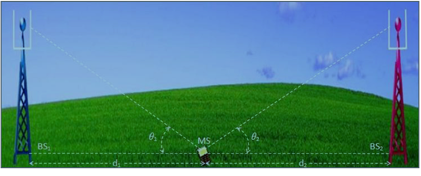
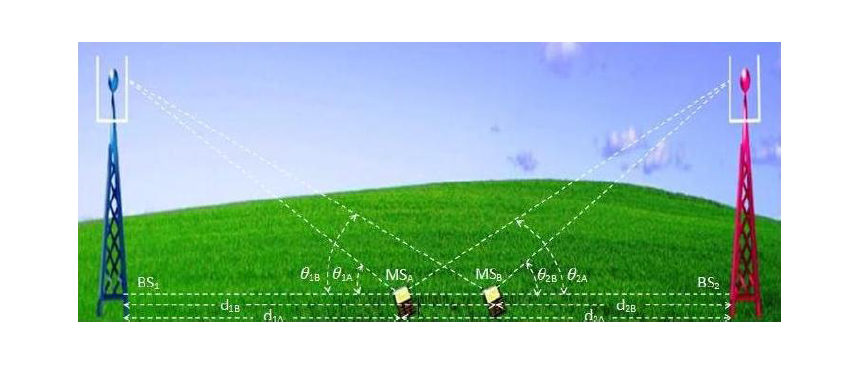

## Theory
**Introduction:**  
The design of a communication system involves selection of values for several parameters. One of the important parameter is the transmit power. Higher transmit power ensures large allowable separation distance between the transmitter (Tx) and receiver (Rx). Of course the loss in signal power per unit distance depends on the properties of the medium. In case of wireless communication on one hand it is desired to have a very large coverage (large allowable separation between Tx and Rx) on the other hand it is also desired that co-channel interference be as low as possible. An understanding of the large scale propagation effects is very important for design of suitable communication system. In terrestrial mobile communication system, electro-magnetic wave propagation is affected by reflection, diffraction and scattering. These lead to dynamic variation of signal strength as a function of time, frequency, distance of separation, antenna height, antenna configuration, local scattering environment etc. Propagation models are necessary in order to predict the received signal strength for a given set of parameters as mentioned above. These models can be broadly considered under:-

- Large scale Fading Model.

- Small Scale Fading Model.

### 1.1 Large Scale Fading:-

Large Scale Fading is dealt by propagation models that predict the mean received signal strength for an arbitrary transmitter receiver separation. The large scale fading model gives such an average with measurements across $4\lambda$ to $40\lambda$, where $\lambda$ is the wavelength. This is useful for estimating coverage area. Large Scale fading can be broadly classified as:-
- Path Loss.
- Shadowing.

      
      

Large scale fading is heavily affected by power dissipation and effects of the propagation channels. The models assume some path loss at a given distance between Tx and Rx i.e. there is no shadowing. It is useful in getting a quick estimate of the average signal strength, hence the coverage. These models are used for prediction of signal variation across 100m-1000m.

There have been ray tracing methods which are complicated and are useful for static scenarios. In case of dynamic scenarios statistical models are used. A statistical model ensures that the statistical properties of the numbers generated using the model matches the recorded values.

We begin with Friis Free space propagation loss. The received power at a distance 'd' is given by.

$P_r(d) = \frac{P_t G_t G_r \lambda^2}{(4\pi d)^2 L}$       where $G = \frac{4\pi A_e}{\lambda^2}$

P_t = Transmitter Power.

P_r(d) = Received power at a distance 'd'.

G_t = Transmit antenna power gain.

G_r = Received antenna power gain.

$\lambda$ = Wavelength.

A_e = Effective aperture related to the physical size of antenna.

L>=1 System loss factor not related to propagation.
Transmission line , Filter losses, Antenna loss etc .

D = T_x - R_x separation distance.
P_r decrease as square of distance 20 dB/ decade.

Path loss gives a measure of signal attenation. It is usually measured in dB. It is defined as a difference between the transmitted antenna gains.

The path loss for free space model is

$PL(\text{dB}) = 10\log_{10}\left(\frac{P_t}{P_r}\right) = -10\log_{10}\left[\frac{G_t G_r \lambda^2}{(4\pi)^2 d^2}\right]$

It may be remembered that Friis free space model is valid for 'd' in the far field of the transmission antenna. The far field / Fraunhofer region is beyond the far field distance, where $d_f = \frac{2D^2}{\lambda}$.

It is related to the largest linear dimension of the antenna aperture and carrier wavelength. d is the largest linear distance of the antenna. $d_f \gg d$ and $d_f \gg \lambda$ then it is the far field region. For path loss models 'd' can't be 0.
Therefore a close in distance is used which is known as the received power reference point .Thus $P_r(d)$ for $d>d_0$ may be reference to $P_r(d_0)$ where $P_r(d_0)$ may be predicted from Friis free space propagation loss model. It may also be obtained from measurements by using average of several recordings at distance $d_0$. The distance $d_0 \gg d_f$ but $d_0$ is sufficiently smaller than practical BS-MS distance.

$P_r(d) = P_r(d_0) \left(\frac{d_0}{d}\right)^2$,     $d \ge d_0 \ge d_f$

Usually received signal strength is measured in dBm or dBw.

$P_r(d) \text{[dBm]} = 10\log_{10}\left(\frac{P_r(d_0)}{10^{-3} \text{W}}\right) + 20\log_{10}\left(\frac{d_0}{d}\right)$ ,   $d \ge d_0 \ge d_f$

Where $P_r(d_0)$ is in watt.

The Value $d_0$ in 1-2 GHz.
~1m for indoor condition.
~100m / 1km for indoor condition.

The received power predicted by path loss models is influenced by

#### Reflection: Reflection occurs when the propagation waves impinge on objects with dimension larger than $\lambda$.

#### Diffraction: Diffraction is caused by sharp irregularities in the path of radio waves. It leads to development of secondary wave fronts, bending of waves. It is caused by objects which are in order in $\lambda$. It depends on geometry of the objects, amplitude, phase and polarization of incident waves.

#### Scattering: Scattering is caused by objects which are smaller than $\lambda$.

Using the famous 2-Ray propagation model [Ref(Rappaport)] . It can be shown that when a transmitter at height $h_t$ transmit with power $P_t$ having antenna gain $G_t$ the receiver signal power at the receiver located at height $h_r$ using an antenna with gain $G_r$ and located at a distance 'd' from the transmitter given by

$P_r = P_t G_t G_r \left(\frac{h_t^2 h_r^2}{d^4}\right)$,    for $d \gg \sqrt{h_t h_r}$

When $\theta_\Delta$ is small (< 0.3rads) $\sin(\theta_\Delta / 2) \approx (\theta_\Delta / 2)$

$\frac{\theta_\Delta}{2} \approx \frac{2\pi h_t h_r}{\lambda d} \rightarrow d > \frac{20\pi h_t h_r}{3\pi} \approx \frac{20 h_t h_r}{\lambda}$

For all above range of d,

$E_{TOT} \approx \frac{2E_0 d_0}{d} \frac{2\pi h_t h_r}{\lambda d} \approx \frac{k}{d^2} \text{ V/m}$

k is related to $E_0$, antenna heights and $\lambda$

Power received is proportional to square of electric field.

Therefore received power from transmitter at a distance d is

$P_r = P_t G_t G_r \left(\frac{h_t^2 h_r^2}{d^4}\right)$,    for $d \gg \sqrt{h_t h_r}$

Power deceases with fourth power d $\rightarrow$ 40dB / decade

The pathloss for the 2 Ray model is given by

$PL(\text{dB}) = 40\log(d) - (10\log(G_t) + 10\log(G_r) + 20\log(h_t) + 20\log(h_r))$

In general the PL and $d^{-n_r}$ is the pathloss exponent. The value of $n_p$ can be obtained analytically/emperically.

Emperically models have the advantage of taking all factors into account (both known and unknown).It is based on actual field measurement.
Its disadvantage is that it is valid for only the measured frequency and location. Generally

$\overline{PL}(\text{dB}) = \overline{PL}(d_0) + 10 n_p \log\left(\frac{d}{d_0}\right)$

      
      
<strong>Fig. 2. Environment and Pathloss</strong>

Pathloss models are defined for:

1. Indoor office test environment

$PL = 37 + 30\log_{10}(R) + (18 \times 3 \times n^{(\frac{n+2}{n+1} - 0.46)})$ [dB]

R = transmitter-receiver Seperation.

n = no. of floor in the path.

L shall in all cases > free space loss.

2. Outdoor to indoor and pedestrian testr environment(base model)
   
$PL = 40\log_{10}(R) + 30\log_{10}(f) - 49$ [dB]

R = base station to mobile station deviation [Km],

f = carrier frequency [MHz], reference 2000 MHz.

3. Vehicular test environment
   
$PL = 40(1 - 4 \times 10^{-3} \Delta h_b)\log_{10}(R) - 18\log_{10}(\Delta h_b) + 21\log_{10}(f) + 80$ [dB]

R = base station to mobile station deviation [Km],

f = carrier frequency [MHz], reference 2000 MHz.

$h_b$ = Base station height[m] above average roof top level.

Path Loss deals with the propagation loss due to distance between transmitter and receiver while shadowing describes variation in the average signal strength due to varying environmental clutter at different locations.

## This experiment is on Path Loss Models.

### 1.2 Important Formulas:-

These two formulas are for calculating the received signal strength and path loss exponent. These two formulas are applicable for EXPT 1A and EXPT 1B.

$P_r(d) = P_r(d_0) + 10 n_p \log_{10}\left(\frac{d_0}{d}\right)$

Where,

- $P_r(d)$ = received signal strength for a certain Tx-Rx separation distance,

- d = certain Tx-Rx separation distance in meters,

- $P_r(d_0)$ = received signal strength at a close-in-reference-distance,

- $d_0$ = close-in reference distance from transmitter in meters.

$PL(\text{dB}) = PL(d_0) + 10 n_p \log_{10}\left(\frac{d}{d_0}\right)$

Where,
$n_p$ = the path loss exponent.

### 1.3 Advanced Formula:-

This advanced formula given below calculates the path loss for a particular application and captures the effect of base station antenna height, receiver antenna height and carrier frequency.

$PL = 10 n_p \log_{10}(d) + 7.8 - 18\log_{10}(h_{BS}) - 18\log_{10}(h_{UT}) + 20\log_{10}(f_c)$

Where,

- d = Tx-Rx, i.e., Tx and Rx separation distance in meters.

- $h_{BS}$ = the base station antenna height in meters.

- $h_{UT}$ == the user terminal i.e. receiver antenna height in meters.

- fc is the carrier frequency in GHz.

This formula is applicable for EXPT 1C, 1D, 1E.

     
 
